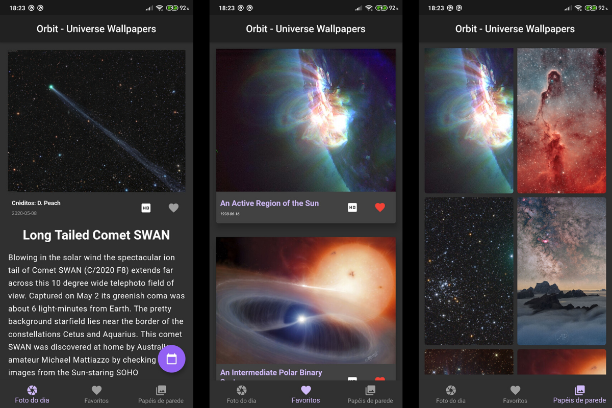

# Orbit

Orbit é um aplicativo mobile feito em Flutter para fornecer, todos os dias, imagens diferentes sobre o universo. Para tanto, usa-se a API da NASA chamada Astronomy Picture of the Day (APOD).

## Screenshot

## Funções

1. Busca a foto do dia,
2. Busca uma foto a partir de uma determinada data,
3. Permite a ida até um link com a foto em resolução HD,
4. Exibe uma grid com fotos de datas aleatórias,
5. Permite favoritar fotos e desfavoritar fotos.

## Próximas Features

- [ ] [Implementar videoplayer dentro do app](https://flutter.dev/docs/cookbook/plugins/play-video).

- [ ] Repensar em como implementar o cache das imagens e do banco de dados de forma mais inteligente.
